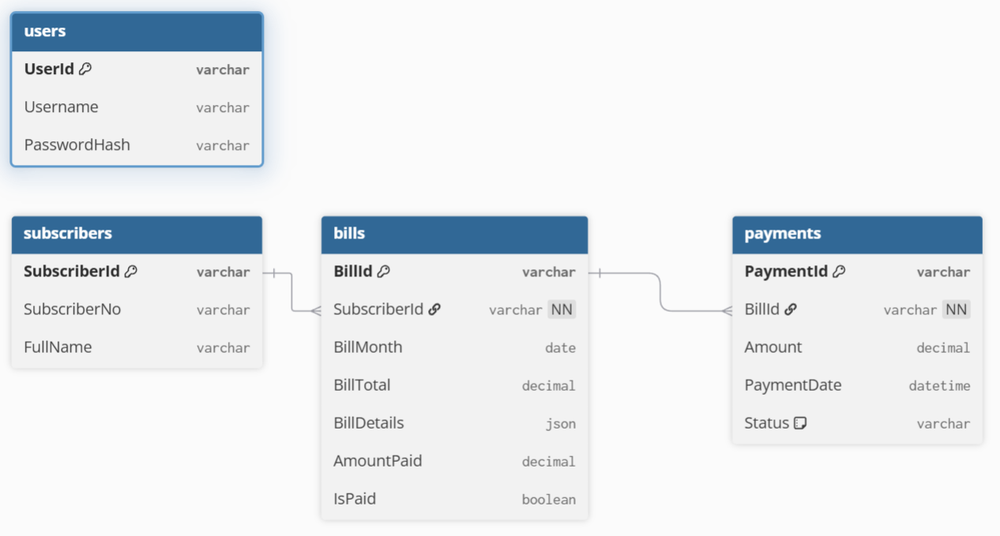

# Bill Pay API Project

## Project Overview
This project implements a RESTful billing API for managing subscribers, bills, and payments. The APIs are fully versioned, support authentication, paging, and are configured behind an API gateway with logging and rate limiting.

- **API Hosting:** [Bill Pay API on Render](https://bill-pay-api.onrender.com)  
- **API Gateway (YARP):** [Mobile Billing Gateway](https://mobile-billing-gateway-2kqo.onrender.com)  
- **Database:** PostgreSQL (`billing-postgres`)

All APIs are documented with Swagger UI, pointing to the API Gateway invoke URL.

---

## Features
- Versioned RESTful services (e.g., `/api/v1/...`)  
- JWT authentication  
- Paging support for list endpoints  
- Logging of request and response data:
  - **Request-level logs:** HTTP method, request path, timestamp, source IP, headers, request size, auth success/failure  
  - **Response-level logs:** Status code, latency, mapping failures, response size  
- API Gateway with rate limiting  
- Data persistence in PostgreSQL  
- Swagger UI documentation

---

## Data Model

### ER Diagram

## Assumptions
- Authentication is implemented using JWT.  
- API Gateway handles routing, rate limiting, and logging; authentication at the gateway level is optional.  
- Bill details are stored as JSON (`jsonb`) in PostgreSQL for flexibility.  
- Amounts are stored as `decimal` for financial precision.  
- All timestamps are in UTC.  
- API supports paging for list endpoints (e.g., subscribers, bills, payments).  
- Users can only access bills and payments related to their account.  
- Payment status defaults to `"Successful"` unless specified otherwise.

---

## Deployment
- All services are deployed on Render.com.  
- PostgreSQL instance `billing-postgres` is hosted in the cloud.  
- API Gateway is deployed on a separate Render service using YARP.  
- Swagger UI points to the API Gateway endpoints.

---

## Swagger Documentation
All APIs have Swagger UI pointing to the API Gateway:

- [Swagger for Bill Pay API](https://mobile-billing-gateway-2kqo.onrender.com/swagger)

---

## Issues Encountered
- Handling JSON storage for `BillDetails` required specific PostgreSQL `jsonb` configuration.  
- API Gateway logging and request mapping needed fine-tuning to capture all headers, request size, and IP addresses.  
- Rate limiting configuration required testing to balance performance and usability.  
- Deployment to Render.com required environment variables setup for database connection and JWT secret.

---

## Source Code
- GitHub Repository: [YourRepoLinkHere](https://github.com/yourusername/bill-pay-api)

---

## Demo Video
- Short video presenting the project: [YourVideoLinkHere](https://link-to-your-video.com)
